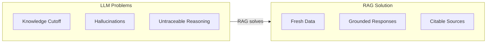
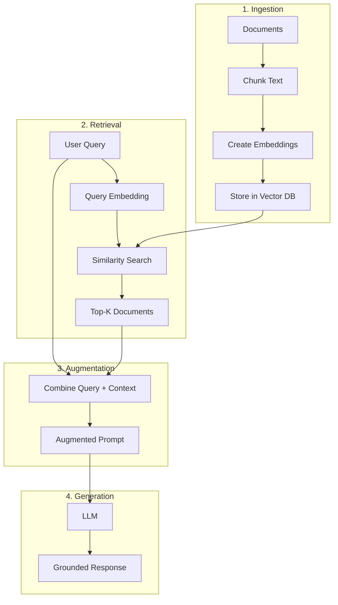
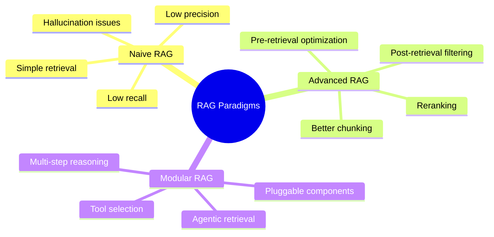
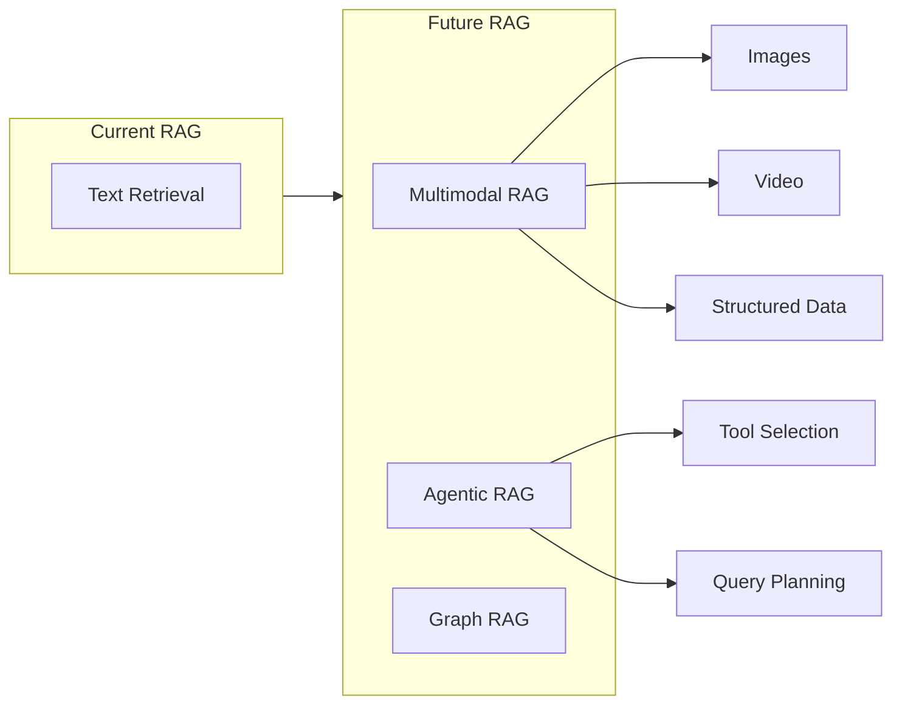

# Research Report: Retrieval Augmented Generation (RAG)

**Topic**: How RAG Works with LLMs
**Generated**: 2025-02-26
**Skill Used**: research-visualizer
**Mode**: Quick (per deep-research reference)

---

## Executive Summary

RAG (Retrieval Augmented Generation) is a technique that enhances LLMs by retrieving relevant external data before generating responses. It solves the "knowledge cutoff" problem and reduces hallucinations by grounding responses in authoritative sources. The process involves four steps: Ingestion, Retrieval, Augmentation, and Generation.

---

## 1. Why RAG Exists

LLMs have a knowledge cutoff date and can hallucinate. RAG fixes this by fetching current, relevant data at query time.

---

## 2. How RAG Works

Four core components: Ingestion → Retrieval → Augmentation → Generation

---

## 3. RAG Evolution (2024)

Three paradigms from the research literature:

---

## 4. Key Benefits

| Benefit | Description |
|---------|-------------|
| **Fresh Data** | Access information beyond training cutoff |
| **Reduced Hallucination** | Responses grounded in sources |
| **Cost Efficient** | No need to retrain LLM |
| **Transparency** | Users can verify cited sources |
| **Domain Specific** | Works with proprietary data |

---

## 5. Emerging Trends

---

## Limitations

RAG does not completely prevent hallucinations - the LLM can still hallucinate around the source material in its response.

---

## Sources

- [Retrieval-augmented generation - Wikipedia](https://en.wikipedia.org/wiki/Retrieval-augmented_generation)
- [What is RAG? - AWS](https://aws.amazon.com/what-is/retrieval-augmented-generation/)
- [RAG Survey - arXiv](https://arxiv.org/abs/2312.10997)
- [RAG for LLMs - Prompt Engineering Guide](https://www.promptingguide.ai/research/rag)
- [What Is RAG - NVIDIA](https://blogs.nvidia.com/blog/what-is-retrieval-augmented-generation/)

---

*Generated using research-visualizer composite skill*
*Workflow: Deep Research (quick mode) → Mermaid Diagrams → Compile Report*
