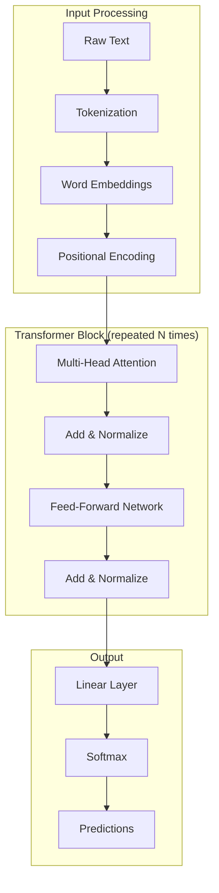
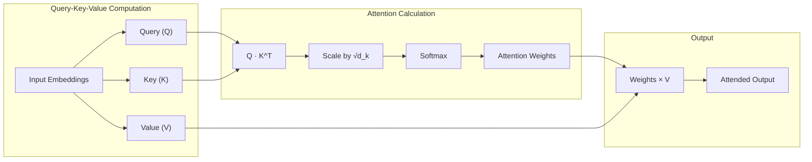
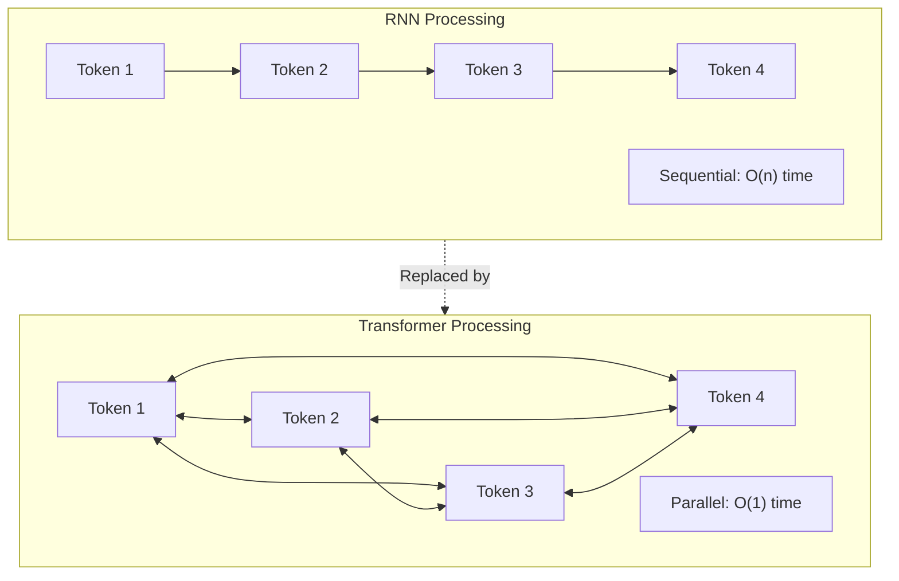
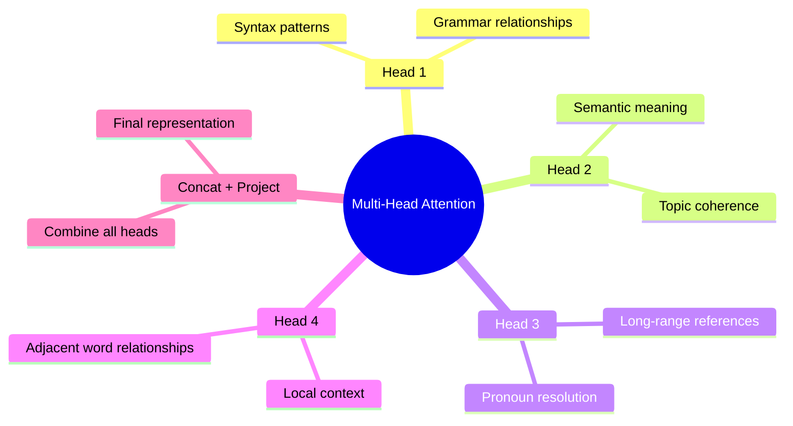
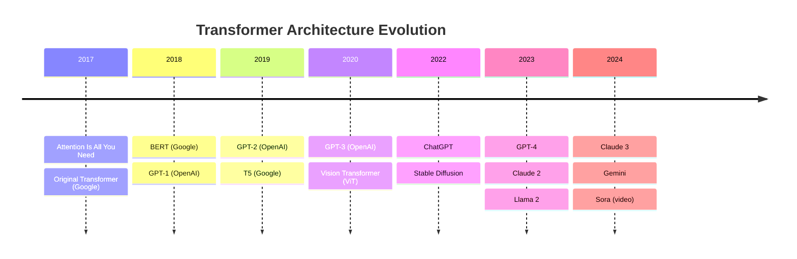
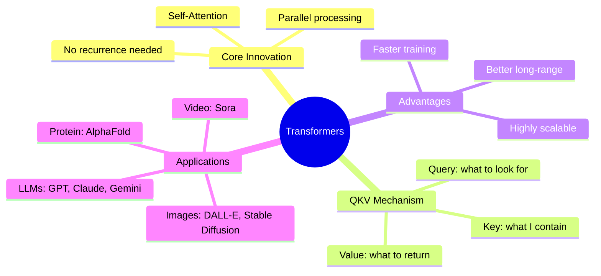

# Research Report: How Transformers Work in AI

**Topic**: Transformer Architecture and Attention Mechanisms
**Generated**: 2025-02-26
**Skill Used**: research-visualizer (deep-research + mermaid-diagrams)

---

## Executive Summary

Transformers are neural network architectures that revolutionized AI by using self-attention mechanisms to process entire sequences in parallel, replacing sequential RNNs. The key innovation is the Query-Key-Value attention system that lets models focus on relevant parts of input regardless of position, enabling modern LLMs like GPT, Claude, and Gemini.

---

## 1. Transformer Architecture Overview

The transformer architecture was introduced in the 2017 paper "Attention Is All You Need" by Google researchers. It processes text by converting it to numerical tokens, then using attention mechanisms to understand relationships.

**Key Components:**
- **Tokenization**: Text split into tokens (words or subwords)
- **Embeddings**: Tokens converted to vectors
- **Positional Encoding**: Position information added
- **Multi-Head Attention**: Core mechanism (see below)
- **Feed-Forward Network**: Processes attention output

---

## 2. The Attention Mechanism

Self-attention is the core innovation. It computes relevance between all tokens simultaneously using Query, Key, and Value matrices.

**How it works:**
1. Each token creates a Query ("what am I looking for?")
2. Each token creates a Key ("what do I contain?")
3. Dot product Q·K gives relevance scores
4. Softmax converts to attention weights
5. Weighted sum of Values produces output

---

## 3. Why Transformers Beat RNNs

| Aspect | RNN/LSTM | Transformer |
|--------|----------|-------------|
| Processing | Sequential | Parallel |
| Long-range dependencies | Difficult (vanishing gradient) | Easy (direct attention) |
| Training speed | Slow | Fast |
| Scalability | Limited | Excellent |

---

## 4. Multi-Head Attention

Multiple attention "heads" run in parallel, each learning different patterns:

Each head has its own Q, K, V weights, allowing the model to attend to different aspects simultaneously.

---

## 5. Timeline: Transformer Evolution

---

## Key Takeaways

---

## Sources

- [Transformer (deep learning) - Wikipedia](https://en.wikipedia.org/wiki/Transformer_(deep_learning))
- [How Transformers Work - DataCamp](https://www.datacamp.com/tutorial/how-transformers-work)
- [Attention Is All You Need - arXiv](https://arxiv.org/abs/1706.03762)
- [What is an attention mechanism? - IBM](https://www.ibm.com/think/topics/attention-mechanism)
- [Transformer Explainer - Polo Club](https://poloclub.github.io/transformer-explainer/)

---

*Generated using research-visualizer composite skill*
*Skills used: claude-deep-research-skill, mermaid-diagrams*
