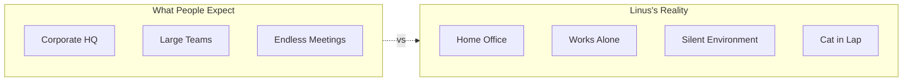
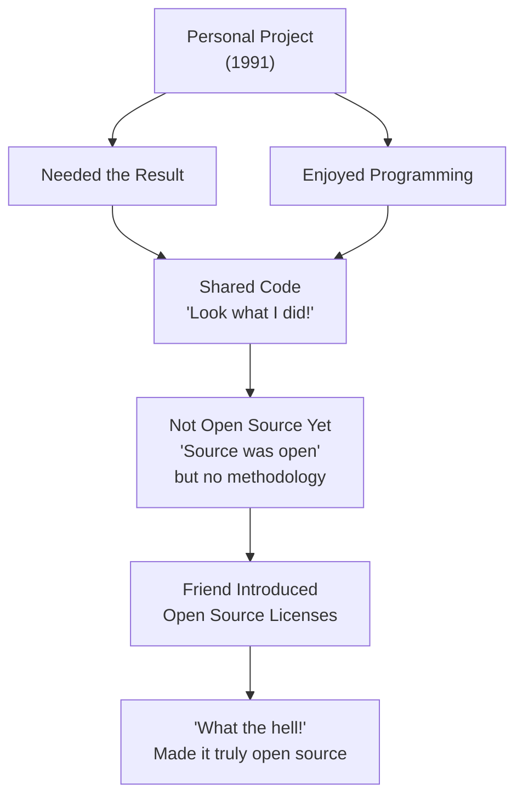
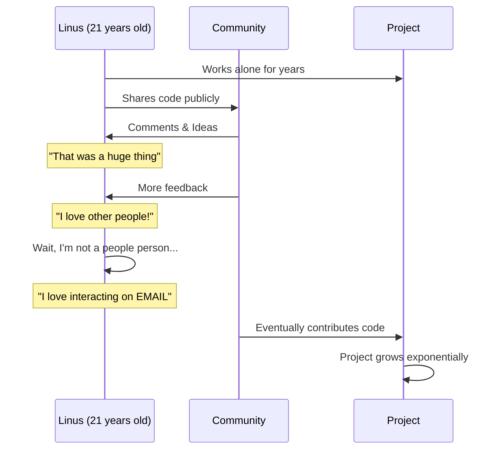
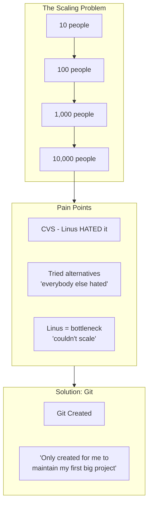
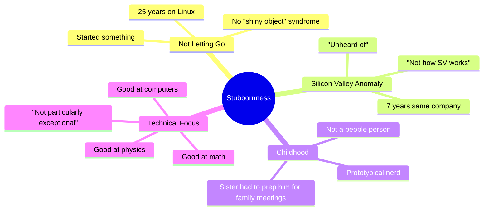
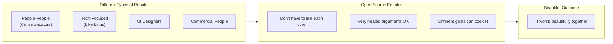
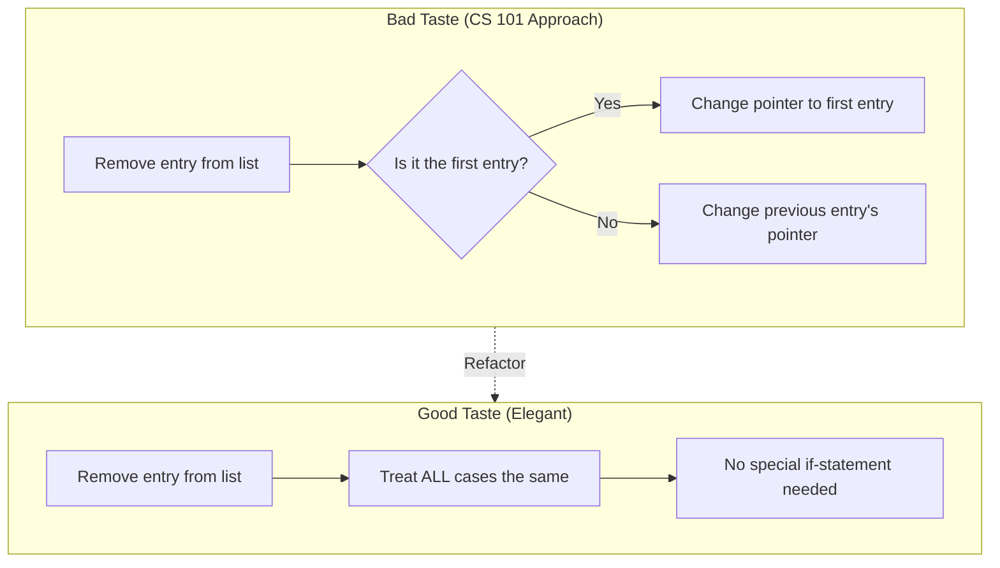
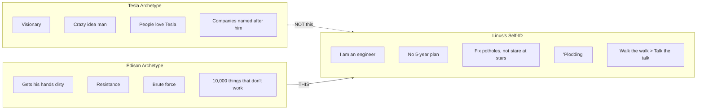
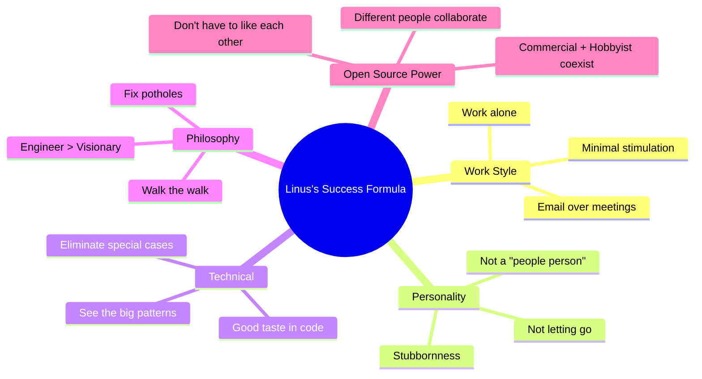

# Study Guide: Linus Torvalds - The Mind Behind Linux

**Source**: [TED Talk - Linus Torvalds: The Mind Behind Linux](https://www.ted.com/talks/linus_torvalds_the_mind_behind_linux)
**Generated**: 2025-02-25
**Duration**: ~21 minutes

---

## Table of Contents

1. [The Unlikely Headquarters](#1-the-unlikely-headquarters)
2. [How Linux Actually Started](#2-how-linux-actually-started)
3. [The Power of Community Feedback](#3-the-power-of-community-feedback)
4. [Why Git Was Created](#4-why-git-was-created)
5. [The Stubbornness Factor](#5-the-stubbornness-factor)
6. [Working with Different People](#6-working-with-different-people)
7. [What is "Good Taste" in Code](#7-what-is-good-taste-in-code)
8. [Engineer vs Visionary](#8-engineer-vs-visionary)
9. [Key Takeaways](#9-key-takeaways)

---

## 1. The Unlikely Headquarters

**Timestamp**: 0:00 - 2:00

Linus works alone from a quiet home office - not a fancy corporate headquarters. His setup prioritizes minimal stimulation: light green walls (like a mental institution), silent computer, and solitude.

**Key Points:**
- Linux powers millions of computers, the Internet, and 1.5 billion Android devices
- All managed by one person working in a bathrobe from home
- The walking desk is the most interesting thing - and he doesn't use it anymore

---

## 2. How Linux Actually Started

**Timestamp**: 2:00 - 4:00

Linux was NOT started as an open-source collaborative project. It began as a personal project - one of many Linus did for himself because he needed the result AND enjoyed programming.

**Key Quote**: "I did not start Linux as a collaborative project. I started it as one in a series of many projects I had done at the time for myself."

---

## 3. The Power of Community Feedback

**Timestamp**: 4:00 - 6:30

The transformation came not from code contributions initially, but from IDEAS and FEEDBACK. Having someone else take interest in your code was "a huge thing."

**Key Insight**: The value wasn't in code contributions at first - it was the revelation that others cared enough to provide feedback.

**Linus on Loving People:**
> "I love other people! Don't get me wrong - I'm actually not a people person... But I love computers, I love interacting with other people on email, because it kind of gives you that buffer."

---

## 4. Why Git Was Created

**Timestamp**: 7:00 - 9:00

Git exists because Linux grew too big to manage. When you have 10,000 contributors (1,000 per release every 2-3 months), you need new tools.

**Key Quote**: "Git is my second big project, which was only created for me to maintain my first big project."

**The Pattern**: Both Linux and Git arose from Linus's desire to NOT work with too many people directly.

---

## 5. The Stubbornness Factor

**Timestamp**: 9:00 - 11:00

Linus's sister identified his "biggest exceptional quality" - he would not let go. This stubbornness defines his success.

**Chris Anderson asks**: "That's not about being a geek and being smart, that's about being... stubborn?"

**Linus confirms**: "That's about being stubborn."

---

## 6. Working with Different People

**Timestamp**: 11:00 - 14:00

Open source allows different personality types to collaborate without necessarily liking each other. Commercial interests turned out to be "lovely, lovely people."

**On Being Myopic About Feelings:**
> "Sometimes I'm also... 'myopic' when it comes to other people's feelings, and that sometimes makes you say things that hurt other people. And I'm not proud of that."

**On UI Skills:**
> "If I was stranded on an island and the only way to get off that island was to make a pretty UI, I'd die there."

---

## 7. What is "Good Taste" in Code

**Timestamp**: 14:00 - 16:30

Linus demonstrates "taste" using a singly-linked list removal example. Good taste means eliminating special cases.

**The Principle:**
> "Sometimes you can see a problem in a different way and rewrite it so that a special case goes away and becomes the normal case. And that's good code."

**Bigger Picture:**
> "Good taste is about really seeing the big patterns and kind of instinctively knowing what's the right way to do things."

---

## 8. Engineer vs Visionary

**Timestamp**: 16:30 - 20:00

Linus explicitly rejects the "visionary" label. He identifies as an engineer, not a dreamer.

**Key Quote:**
> "I'm perfectly happy with all the people who are walking around and just staring at the clouds and looking at the stars and saying, 'I want to go there.' But I'm looking at the ground, and I want to fix the pothole that's right in front of me before I fall in."

**On Being Edison:**
> "I do think that vision is important, but I think visions are cheap... It's the people who... fix the small details... those are the heroes."

---

## 9. Key Takeaways

### Summary Points

| Trait | Description |
|-------|-------------|
| **Stubbornness** | Won't let go; worked on Linux for 25+ years |
| **Introversion** | Works alone in bathrobe; prefers email to meetings |
| **Taste** | Instinctively knows elegant solutions; eliminates special cases |
| **Pragmatism** | Engineer mindset; fixes potholes rather than chasing visions |
| **Honesty** | Admits being "myopic" about others' feelings |

### Timestamps Reference

| Time | Topic |
|------|-------|
| 0:00 | Introduction - Linux world headquarters |
| 2:00 | How Linux started (not as open source) |
| 4:00 | Community feedback and growth |
| 7:00 | Why Git was created |
| 9:00 | Stubbornness and persistence |
| 11:00 | Working with different people |
| 14:00 | Code taste demonstration |
| 16:30 | Visionary vs Engineer (Tesla vs Edison) |
| 19:00 | Walking the walk |

---

*Generated using video-study-guide composite skill*
*Skills used: youtube-clipper-skill (transcript extraction), mermaid-diagrams (visualization), pdf (export)*
*Source: TED Talk transcript downloaded via yt-dlp*
