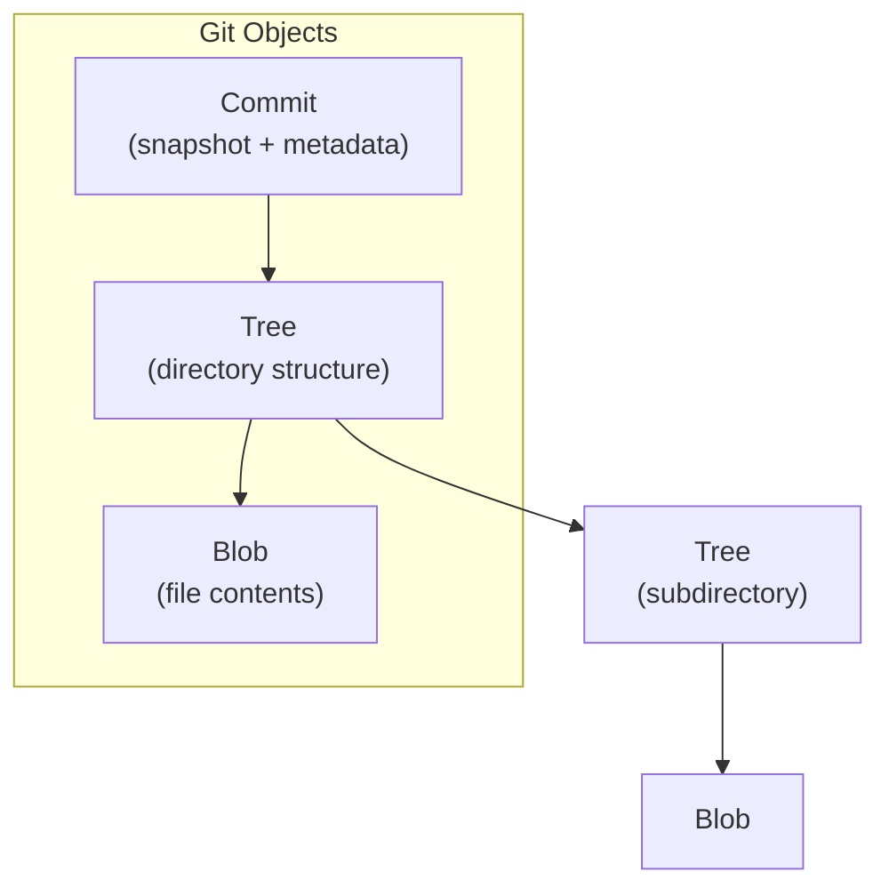
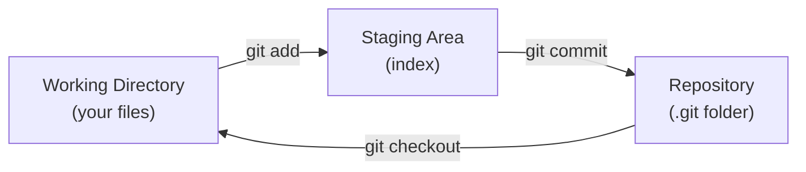
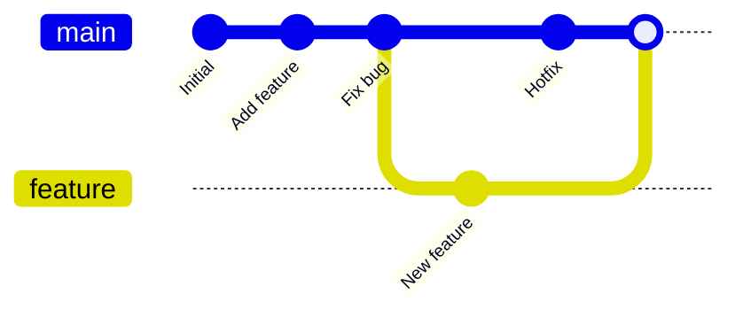
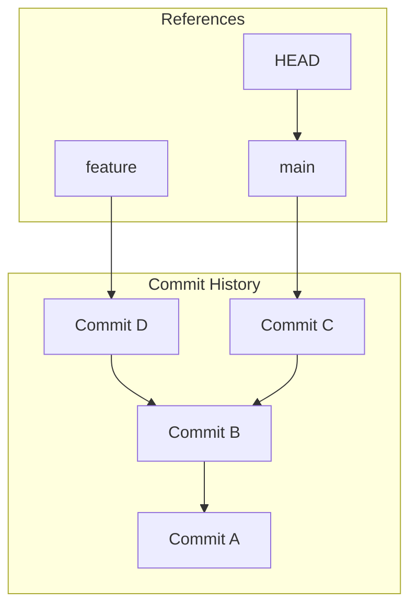
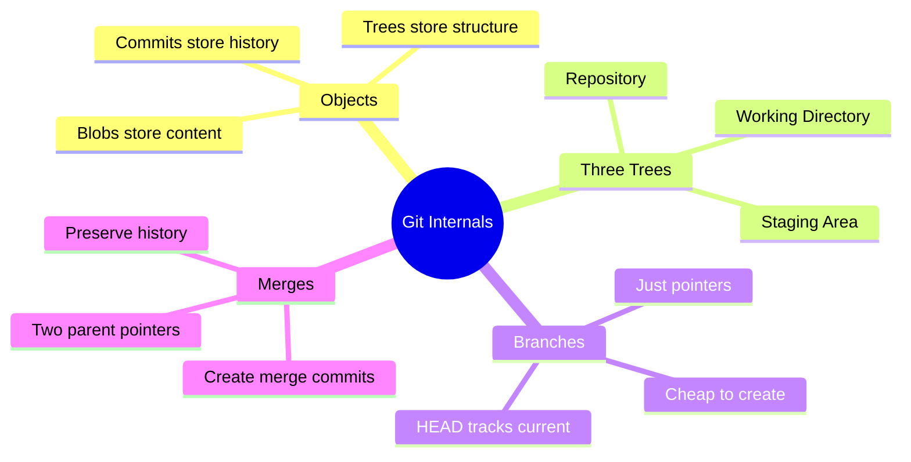

# Study Guide: How Git Works Under the Hood

**Source**: [How Git Works: Explained in 4 Minutes](https://youtube.com/watch?v=e9lnsKot_SQ)
**Generated**: 2025-02-25

---

## Table of Contents

1. [Git's Core Data Structure](#1-gits-core-data-structure)
2. [The Three Trees](#2-the-three-trees)
3. [How Commits Work](#3-how-commits-work)
4. [Branching and Merging](#4-branching-and-merging)
5. [Key Takeaways](#5-key-takeaways)

---

## 1. Git's Core Data Structure

**Timestamp**: 0:00 - 0:45

Git stores everything as **objects** in a content-addressable filesystem. Each object is identified by a SHA-1 hash of its contents.



**Key Points:**
- **Blob**: Stores file contents (no filename, just data)
- **Tree**: Maps filenames to blobs, represents directories
- **Commit**: Points to a tree + contains metadata (author, message, parent)

---

## 2. The Three Trees

**Timestamp**: 0:45 - 1:30

Git manages three "trees" (not to be confused with tree objects):



| Tree | Location | Purpose |
|------|----------|---------|
| Working Directory | Your project folder | Where you edit files |
| Staging Area | `.git/index` | Prepares next commit |
| Repository | `.git/objects` | Permanent history |

---

## 3. How Commits Work

**Timestamp**: 1:30 - 2:30

Each commit is a snapshot, not a diff. Commits form a linked list via parent pointers.



**Commit Structure:**
```
commit 3d59511...
├── tree: a1b2c3d...      (root directory snapshot)
├── parent: f31f077...    (previous commit)
├── author: John Doe
├── committer: John Doe
└── message: "Add login feature"
```

---

## 4. Branching and Merging

**Timestamp**: 2:30 - 3:45

Branches are just pointers to commits. Creating a branch is instant (just creates a 41-byte file).



**Branch Operations:**
- `git branch feature` → Creates pointer to current commit
- `git checkout feature` → Moves HEAD to point at feature
- `git merge feature` → Creates new commit with two parents

---

## 5. Key Takeaways



### Summary

1. **Git is content-addressable** - Everything identified by SHA-1 hash
2. **Commits are snapshots** - Not diffs, complete tree snapshots
3. **Branches are cheap** - Just 41-byte pointer files
4. **History is immutable** - Old commits never change

---

## Timestamps Reference

| Time | Topic |
|------|-------|
| 0:00 | Introduction to Git objects |
| 0:45 | The three trees concept |
| 1:30 | How commits are structured |
| 2:30 | Branching mechanics |
| 3:15 | Merging explained |
| 3:45 | Conclusion |

---

*Generated using video-study-guide composite skill*
*Skills used: youtube-clipper-skill, mermaid-diagrams, pdf*
